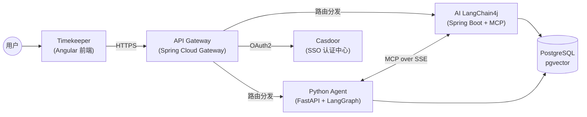

# 🏗️ 项目里程碑 (Project Milestones)

> 本文档记录整个 **AI 智能助手平台** 的版本演进与特性总结。
> 平台由四个子项目协同构建，实现从用户交互到 AI 推理的完整链路。

---

## 系统架构总览

| 子项目 | 技术栈 | 角色 |
|-------|--------|------|
| **timekeeper** | Angular 21 + Material + TailwindCSS | 🖥️ 前端门面 |
| **api-gateway** | Spring Cloud Gateway + WebFlux | 🚪 统一网关 |
| **python-agent** | FastAPI + LangGraph + LangChain | 🧠 AI 大脑 |
| **ai-langchain4j** | Spring Boot + LangChain4j + MyBatis-Plus | 🤖 业务工具 |

---

## ✅ release_1.0.0 — 端到端上线

> **状态**: 已完成  
> **目标**: 实现从前端到后端的完整链路贯通，覆盖认证、对话、知识库、部署全流程

---

### 一、统一认证与安全

实现了基于 Casdoor 的 OAuth2 单点登录体系，覆盖从用户登录到服务间鉴权的完整安全链路。

| 特性 | 涉及服务 | 说明 |
|------|---------|------|
| OAuth2 Authorization Code 登录 | Gateway | 完整对接 Casdoor SSO，支持账号密码、GitHub 等多种社交登录方式 |
| JWT 签发与 HttpOnly Cookie | Gateway | 登录成功后自动生成 JWT（24h 有效期），写入 HttpOnly Cookie 防 XSS |
| 跨子域 Cookie 共享 | Gateway | Cookie 写入 `122577.xyz` 二级域名，多子域名共享登录态 |
| Token 透传与用户身份注入 | Gateway | 解析 JWT 后将 `X-User-Id` / `X-User-Name` / `X-User-Avatar` 注入下游请求头 |
| 前端 SSO 集成 | Timekeeper | `AuthGuard` + `AuthService` 实现未登录自动跳转、Token 自动携带 |
| 登录后回源跳转 | Gateway | `RedirectSaveFilter` 记录来源页面，登录完成后自动跳回原页面 |
| 路由白名单 | Gateway | 可配置的免鉴权路径（`IgnoreWhiteProperties`），灵活控制开放接口 |
| 安全加固 | Gateway | Actuator 仅暴露 `/actuator/health`；无敏感信息泄露；CSRF 关闭（API 网关模式） |
| 统一 401 处理 | Gateway + Timekeeper | 网关返回标准 JSON（含登录 URL），前端拦截器自动处理重定向 |

---

### 二、AI 对话与智能推理

实现了基于 LangGraph 的多步推理 Agent，支持流式输出与工具调用，提供端到端的 AI 对话体验。

| 特性 | 涉及服务 | 说明 |
|------|---------|------|
| LangGraph 多节点编排 | Python Agent | `StateGraph` 构建思考 → 工具调用 → 生成的循环推理链路 |
| SSE 流式对话 | Python Agent + Timekeeper | 后端 `StreamingResponse` 实时输出，前端 Markdown 逐字渲染 |
| 对话状态持久化 | Python Agent | `AsyncPostgresSaver` 将 LangGraph Checkpoint 写入 PostgreSQL，支持断点续聊 |
| 聊天历史记录 | Python Agent + Timekeeper | 对话结束后异步持久化问答记录，前端可查看历史会话 |
| 动态 LLM 配置 | Python Agent | 运行时从 Nacos 动态获取 LLM Provider / Model / API Key，无需重启切换模型 |
| 用户资料展示 | Timekeeper | 从网关获取 SSO 用户信息（头像、昵称），在设置菜单中展示 |

---

### 三、知识库与 RAG

实现了完整的检索增强生成（RAG）管线，从文档解析到向量检索再到上下文增强回答。

| 特性 | 涉及服务 | 说明 |
|------|---------|------|
| 文档解析与语义分块 | Python Agent | 支持多格式文档解析，智能分块保持语义完整性 |
| 向量索引与存储 | AI LangChain4j + Python Agent | 基于 PgVector 的 Embedding Store，统一向量存储 |
| 混合检索 | Python Agent | Vector 向量检索 + BM25 关键词检索 + RRF 重排序，兼顾语义与精确匹配 |
| RAG 增强生成 | Python Agent | 根据 `topic_id` 自动检索相关文档，拼装上下文后交给 LLM 生成精准回答 |
| 知识库管理界面 | Timekeeper | 知识库列表浏览与 Embedding 管理（`knowledge` / `knowledge-embedding` 模块） |
| 知识库业务层 | AI LangChain4j | 完整的 Entity → Mapper → Service → Strategy 分层架构 |

---

### 四、MCP 协议与工具生态

实现了 MCP over SSE 协议，解耦 AI 推理层与业务工具层，支持远程工具的动态发现与调用。

| 特性 | 涉及服务 | 说明 |
|------|---------|------|
| MCP Server | AI LangChain4j | `GET /mcp/sse` 握手建立长连接 + `POST /mcp/messages` 处理 JSON-RPC 指令 |
| MCP Client（SSE 模式） | Python Agent | 通过 SSE 长连接调用 Java 后端 MCP Server，完成远程业务工具调用 |
| MCP Client（Stdio 模式） | Python Agent | 支持本地 CLI 工具（如 Brave Search）的标准输入输出集成 |
| 策略模式工具注册 | AI LangChain4j | 所有工具实现 `McpTool` 接口，Spring 自动扫描并注入工具注册中心 |
| 订单查询工具 | AI LangChain4j | `OrderQueryTool`：首个业务工具示例，通过 MCP 协议对外暴露 |
| 完整 MCP 生命周期 | Python Agent ↔ AI LangChain4j | 连接 → 握手 → 发现（tools/list）→ 执行（tools/call）四阶段标准流程 |

---

### 五、微服务治理与基础设施

实现了基于 Nacos 的服务注册发现与统一配置管理，所有服务通过 Docker 容器化运行。

| 特性 | 涉及服务 | 说明 |
|------|---------|------|
| Nacos 服务注册与发现 | 全部服务 | 各服务启动自动注册，运行时动态发现上下游地址 |
| Nacos 统一配置管理 | 全部服务 | 敏感配置（数据库连接、OAuth Secret、API Key）统一由 Nacos 管理 |
| Spring Cloud Gateway 路由 | Gateway | 按路径前缀分发请求到 Python Agent 和 Java 业务服务 |
| SSE 流式透传 | Gateway | 网关对 SSE 长连接不缓冲，透明代理到前端 |
| PostgreSQL + PgVector | Python Agent + AI LangChain4j | 同时承载业务数据和向量数据 |
| Docker 容器网络 | 全部服务 | 所有服务通过 `pei-network` 互通 |
| Nginx 反向代理 | 基础设施 | 统一 HTTPS 入口，正确透传 `X-Forwarded-*` 头部 |

---

### 六、CI/CD 与自动化部署

实现了四个项目的全自动构建部署管线，支持多分支策略和多平台部署。

| 特性 | 涉及服务 | 说明 |
|------|---------|------|
| GitHub Actions 自动构建 | 全部服务 | Push 到 master 或 feature_* PR 自动触发构建 |
| Docker 多架构镜像 | Gateway + AI LangChain4j | 同时构建 `linux/amd64` 和 `linux/arm64` 镜像 |
| VPS 自动部署 | Gateway + Python Agent + AI LangChain4j | 构建完成后通过 SSH 自动拉取镜像并重启容器 |
| Cloudflare Pages 部署 | Timekeeper | 前端自动部署到 Cloudflare CDN，支持分支环境隔离（master=正式 / dev=测试） |
| 环境变量安全管理 | 全部服务 | 敏感信息通过 GitHub Secrets / Nacos 注入，代码中零硬编码 |

---

## 🔮 后续版本规划（草案）

### release_1.1.0 — 体验优化与稳定性
- [ ] Token 自动续期（Refresh Token 机制）
- [ ] Chat 消息的 Like/Dislike 反馈
- [ ] 对话内容复制 / 导出 / 重新生成
- [ ] 知识库文档上传与处理进度展示
- [ ] 错误边界与优雅降级

### release_1.2.0 — 多模态与工具扩展
- [ ] MCP 插件市场（前端管理界面）
- [ ] 更多 MCP 工具（网络搜索、日历、邮件等）
- [ ] 多模态输入（图片 / 文件上传）
- [ ] AI 计费与用量统计面板（AiBillingFilter）

### release_2.0.0 — 企业级能力
- [ ] 多租户隔离
- [ ] RBAC 权限管理
- [ ] 审计日志
- [ ] 高可用部署（Kubernetes 编排）
- [ ] 监控与告警（Prometheus + Grafana）

---

> 📅 文档维护：随版本迭代持续更新  
> 📝 最后更新：2026-04-24
